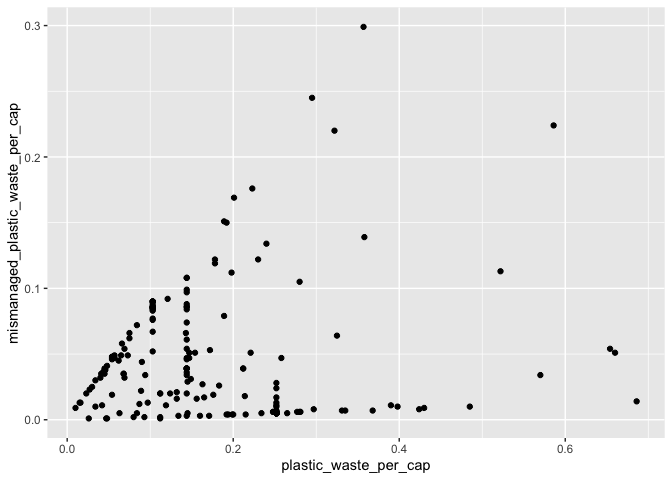

Lab 02 - Plastic waste
================
Karol-Anne Leclerc
15 septembre

## Chargement des packages et des données

``` r
library(tidyverse) 
```

``` r
plastic_waste <- read_csv("data/plastic-waste.csv")
```

Commençons par filtrer les données pour retirer le point représenté par
Trinité et Tobago (TTO) qui est un outlier.

``` r
plastic_waste <- plastic_waste %>%
  filter(plastic_waste_per_cap < 3.5)
```

## Exercices

### Exercise 1

``` r
ggplot(data = plastic_waste, aes (x = plastic_waste_per_cap)) + geom_histogram(binwidth = 0.2) + facet_wrap("continent")
```

<!-- -->

En comparant les contients selon leur quantité de déchets plastiques par
habitant, il est possible d’observer que l’Europe, l’Amérique du Nord
ainsi que l’Asie sont les 3 continents avec les plus gros producteurs de
déchets plastiques par habitant. Plus précisément, l’Amérique du Nord,
semble être le continent avec la plus grosse production de déchets
plastiques par habitant avec le plus haut taux d’habitants dépassant les
0,5kg de déchets plastiques par jour. Quant à l’Amérique du Sud,
l’Océanie et l’Afrique, ceux-ci sont les 3 continents avec la moins
grande production de déchets plastiques par habitant. De plus,
concernant les 6 continents, il est possible d’observer qu’une majorité
de leurs habitants se situent autour d’une production de déchets
plastiques d’environ 10 à 30 kg/jour.

### Exercise 2

``` r
ggplot(plastic_waste, aes(x=plastic_waste_per_cap)) + geom_density()
```

<!-- -->

``` r
ggplot(plastic_waste, aes(x=plastic_waste_per_cap, color=continent)) + geom_density(linewidth=0.25)
```

<!-- -->

``` r
ggplot(plastic_waste, aes(x=plastic_waste_per_cap, color=continent, fill=continent)) + geom_density(linewidth=0.25)
```

<!-- -->

``` r
ggplot(plastic_waste, aes(x=plastic_waste_per_cap, color=continent, fill=continent)) + geom_density(alpha=0.25, linewidth=0.25)
```

<!-- -->

Les réglages de la couleur et de la transparence ne se trouvent pas au
même endroit, car ils ne remplissent pas la même fonction. En effet, les
réglages “color” et “fill” présents dans “aes” sont des paramètres qui
vont varier selon la valeur d’une variable et ainsi créer une légende
pour l’accompagner. D’un autre côté, le réglage “alpha” se trouvant dans
“geom_density” est un paramètre modifiant le visuel général du
graphique, soit tous ses éléments. Donc, ce paramètre est fixe et ne
variera pas selon les données comme pour les paramètres sous “aes”.

### Exercise 3

Boxplot:

``` r
ggplot(plastic_waste, aes(x=continent, y=plastic_waste_per_cap))+geom_boxplot()
```

<!-- -->

Violin plot:

``` r
ggplot(plastic_waste, aes(x=continent, y=plastic_waste_per_cap))+geom_violin()
```

<!-- -->

Contrairement aux boxplots, les violin plots permettent d’avoir une
meilleur visualisation de la distribution des données, soit certaines
variations vu sa structure plus variable que les rectangles/boites. Les
violin plots permettent donc de pouvoir observer les différentes
concentrations des données sur plusieurs valeurs.

### Exercise 4

``` r
ggplot(plastic_waste, aes(x=plastic_waste_per_cap, y=mismanaged_plastic_waste_per_cap))+geom_point()
```

<!-- -->

``` r
ggplot(plastic_waste, aes(x=plastic_waste_per_cap, y=mismanaged_plastic_waste_per_cap, colour = continent))+geom_point()
```

<!-- -->

La relation entre la quantité de déchet et la quantité de déchets non
gérés semble être positive et de façon générale, linéaire. Ainis, chez
un pays, plus la quantité de déchets plastiques produite par habitant
est grande et plus la quantité de déchets plastique non gérés par
habitant semble augmenter. Or, cette tendance ne semble pas être
identique pour chaque continent. En effet, par exemple, pour l’Amérique
du Nord et surtout l’Europe, nous pouvons observer une moins grande
quantité de points démontrant des taux élevés de déchets non gérés.
Donc, pour certains cas où la quantité de déchets plastiques par
habitant est élevé, la quantité de déchets plastiques non gérés par
habitant n’augmente pas de manière proportionnelle. D’un autre côté,
chez d’autres continents comme l’Afrique, l’Asie et l’Océanie, la
tendance positive mentionnée précédemment semble se maintenir, soit qu’à
des taux élevés de déchets plastiques générés par habitant, la quantité
de déchest plastiques non gérés par habitant augmente.

### Exercise 5

``` r
ggplot(plastic_waste, aes(x=plastic_waste_per_cap, y=total_pop))+geom_point()
```

    ## Warning: Removed 10 rows containing missing values or values outside the scale range
    ## (`geom_point()`).

<!-- -->

``` r
ggplot(plastic_waste, aes(x=plastic_waste_per_cap, y=coastal_pop))+geom_point()
```

<!-- -->

Il semble y avoir une relation plus forte entre la paire de variables
comprenant la population vivant sur des côtes et la quantité de déchets
plastiques par habitant. Effectivement, la population coastale semble
plus influencer la quantité de déchets plastiques par habitant que la
population totale.

## Conclusion

Recréez la visualisation:

``` r
plastic_waste_coastal <- plastic_waste %>% 
  mutate(coastal_pop_prop = coastal_pop / total_pop) %>%
  filter(plastic_waste_per_cap < 3)

ggplot(plastic_waste, aes( x=coastal_pop/total_pop, y=plastic_waste_per_cap))+geom_point(aes(colour = continent)) +geom_smooth(method = loess, se=TRUE, color="black") +labs(title = "Quantité de déchets plastiques vs Proportion de la population côtière", subtitle = "Selon le continent", y="Nombre de déchets plastiques par habitant", x="Proportion de la population côtière (Coastal / total population)", colour="Continent")
```

    ## `geom_smooth()` using formula = 'y ~ x'

    ## Warning: Removed 10 rows containing non-finite outside the scale range
    ## (`stat_smooth()`).

    ## Warning: Removed 10 rows containing missing values or values outside the scale range
    ## (`geom_point()`).

<!-- --> Selon ce
graphique, il est possible d’observer, en général, une légère relation
positive selon la courbe de tendance. Cela suggère que plus la
proportion d’habitants vivant près des côtes est grande et plus la
quantité de déchets plastiques par habitant semble augmenter. Or, cette
tendance ne semble pas forte ce qui s’expliquerait par le fait que les
tendances pour chaque continent varient selon le nuage de points. Par
exemple, le continent d’Amérique du Nord suit la tendance jusqu’à une
proportion de population côtière d’environ 0,75, avant de suivre une
tendance négative où la variable y diminue au fur et à mesure que la
varibale x augmente. Concernant l’Amérique du Sud, il n’y a pas de
données disponible après x=0,75, ce qui peut venir affecter l’allure de
la courbe de tendance. Somme toute, malgré l’allure horizontale de la
courbe de tendance, les continents semblent suivre la relation positive
entre les deux variables. Aussi, l’Afrique semble être le continent qui
se rapporche le plus de l’allure de la courbe de tendance.
